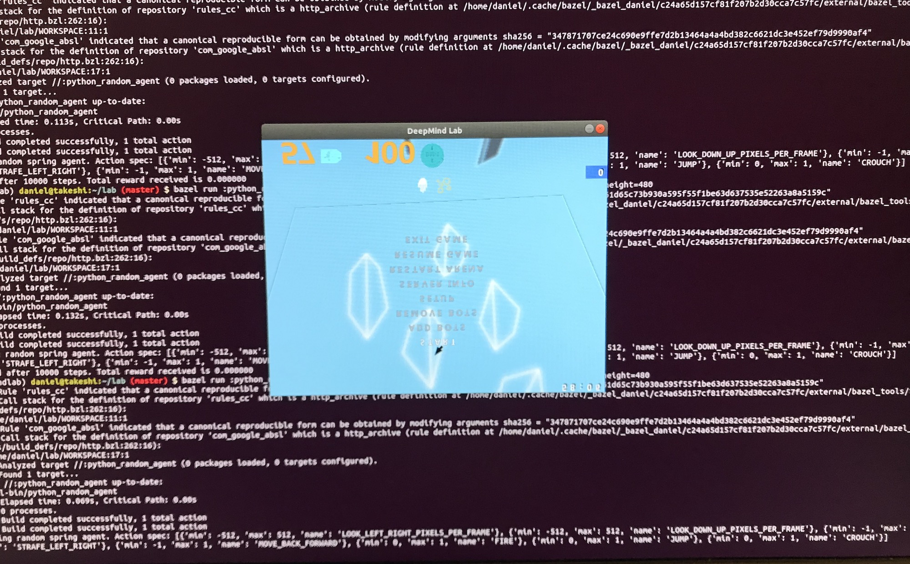
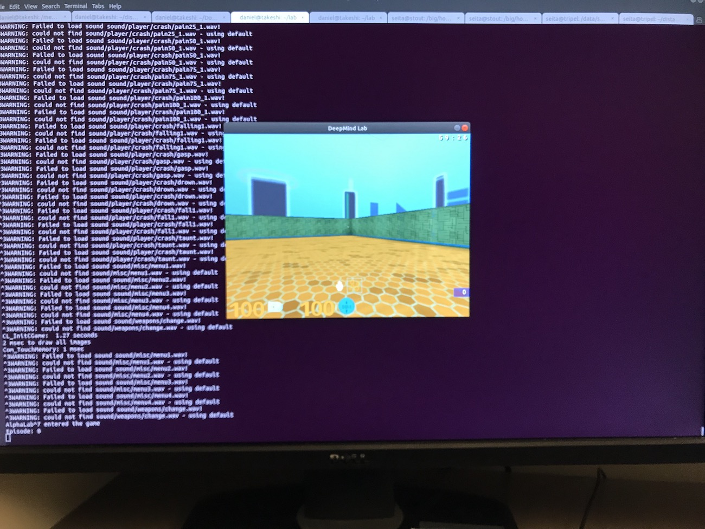

# Setup

- I installed bazel locally. 
- I created a Python 3.6 virtualenv and did `pip install numpy` there.
- I cloned deepmind/lab and then changed `python.BUILD` to use 3.6 instead of 3.5 (just replace the text).

All of these commands below work in that they don't give errors on my Ubuntu 18 machine:

```
# Build the Python interface to DeepMind Lab
lab$ bazel build -c opt //:deepmind_lab.so

# Build and run the tests for it
lab$ bazel test -c opt //python/tests:python_module_test

# Run a random agent
lab$ bazel run -c opt //:python_random_agent
```

*The Python module test originally said "one test failed locally"* but I think it was because I was not in my virtualenv or something like that. When I run it now, it succeeds.

# Random Agent

Running their random agent with the visual seems to work:

```
(deepmindlab) daniel@takeshi:~/lab (master) $ bazel run :python_random_agent --define graphics=sdl --     --length=10000 --width=640 --height=480
DEBUG: Rule 'rules_cc' indicated that a canonical reproducible form can be obtained by modifying arguments sha256 = "f977d49a6fb605964661d65c73b930a595f55f1be63d637535e52263a8a5159c"
DEBUG: Call stack for the definition of repository 'rules_cc' which is a http_archive (rule definition at /home/daniel/.cache/bazel/_bazel_daniel/c24a65d157cf81f207b2d30cca7c57fc/external/bazel_tools/tools/build_defs/repo/http.bzl:262:16):
 - /home/daniel/lab/WORKSPACE:11:1
DEBUG: Rule 'com_google_absl' indicated that a canonical reproducible form can be obtained by modifying arguments sha256 = "347871707ce24c690e9ffe7d2b13464a4a4bd382c6621dc3e452ef79d9990af4"
DEBUG: Call stack for the definition of repository 'com_google_absl' which is a http_archive (rule definition at /home/daniel/.cache/bazel/_bazel_daniel/c24a65d157cf81f207b2d30cca7c57fc/external/bazel_tools/tools/build_defs/repo/http.bzl:262:16):
 - /home/daniel/lab/WORKSPACE:17:1
INFO: Analyzed target //:python_random_agent (0 packages loaded, 0 targets configured).
INFO: Found 1 target...
Target //:python_random_agent up-to-date:
  bazel-bin/python_random_agent
INFO: Elapsed time: 0.131s, Critical Path: 0.00s
INFO: 0 processes.
INFO: Build completed successfully, 1 total action
INFO: Build completed successfully, 1 total action
Starting random spring agent. Action spec: [{'min': -512, 'max': 512, 'name': 'LOOK_LEFT_RIGHT_PIXELS_PER_FRAME'}, {'min': -512, 'max': 512, 'name': 'LOOK_DOWN_UP_PIXELS_PER_FRAME'}, {'min': -1, 'max': 1, 'name': 'STRAFE_LEFT_RIGHT'}, {'min': -1, 'max': 1, 'name': 'MOVE_BACK_FORWARD'}, {'min': 0, 'max': 1, 'name': 'FIRE'}, {'min': 0, 'max': 1, 'name': 'JUMP'}, {'min': 0, 'max': 1, 'name': 'CROUCH'}]
Finished after 10000 steps. Total reward received is 0.000000
```

But the really weird thing is that I get these images *which show the text upside down*: 



This seems to explain why: https://github.com/deepmind/lab/issues/104 

I hit the ESCAPE key to pause the game so it shows the screen. Otherwise the agent just moves randomly and it's distracting. It will automatically terminate after the maximum steps even if I pause it.

Doing the `sdl2` graphics option also works:

```
(deepmindlab) daniel@takeshi:~/lab (master) $ bazel run :python_random_agent --define graphics=sdl2 --     --length=10000 --width=640 --height=480
DEBUG: Rule 'rules_cc' indicated that a canonical reproducible form can be obtained by modifying arguments sha256 = "f977d49a6fb605964661d65c73b930a595f55f1be63d637535e52263a8a5159c"
DEBUG: Call stack for the definition of repository 'rules_cc' which is a http_archive (rule definition at /home/daniel/.cache/bazel/_bazel_daniel/c24a65d157cf81f207b2d30cca7c57fc/external/bazel_tools/tools/build_defs/repo/http.bzl:262:16):
 - /home/daniel/lab/WORKSPACE:11:1
DEBUG: Rule 'com_google_absl' indicated that a canonical reproducible form can be obtained by modifying arguments sha256 = "347871707ce24c690e9ffe7d2b13464a4a4bd382c6621dc3e452ef79d9990af4"
DEBUG: Call stack for the definition of repository 'com_google_absl' which is a http_archive (rule definition at /home/daniel/.cache/bazel/_bazel_daniel/c24a65d157cf81f207b2d30cca7c57fc/external/bazel_tools/tools/build_defs/repo/http.bzl:262:16):
 - /home/daniel/lab/WORKSPACE:17:1
INFO: Analyzed target //:python_random_agent (0 packages loaded, 0 targets configured).
INFO: Found 1 target...
Target //:python_random_agent up-to-date:
  bazel-bin/python_random_agent
INFO: Elapsed time: 0.073s, Critical Path: 0.00s
INFO: 0 processes.
INFO: Build completed successfully, 1 total action
INFO: Build completed successfully, 1 total action
Starting random spring agent. Action spec: [{'min': -512, 'max': 512, 'name': 'LOOK_LEFT_RIGHT_PIXELS_PER_FRAME'}, {'min': -512, 'max': 512, 'name': 'LOOK_DOWN_UP_PIXELS_PER_FRAME'}, {'min': -1, 'max': 1, 'name': 'STRAFE_LEFT_RIGHT'}, {'min': -1, 'max': 1, 'name': 'MOVE_BACK_FORWARD'}, {'min': 0, 'max': 1, 'name': 'FIRE'}, {'min': 0, 'max': 1, 'name': 'JUMP'}, {'min': 0, 'max': 1, 'name': 'CROUCH'}]
Finished after 10000 steps. Total reward received is 0.000000
```

But:

- A screen of the maze does not appear!
- It seems to take longer for some reason, even though the numebr of steps is 10k for both. With `sdl` I am getting about 8 seconds for 10k steps, but `sdl2` requires about 22 seconds. ?!?


## ssh Connections

If I do `ssh daniel@...` to my machine, I cannot get the sdl command to run:

```
bazel run :python_random_agent --define graphics=sdl --     --length=10000 --width=640 --height=480
```

Regardless of normal ssh or ssh with X forwarding, i.e., `ssh -X daniel@...`. The normal ssh gives me this at the end:

```
INFO: Elapsed time: 30.978s, Critical Path: 15.69s
INFO: 695 processes: 695 linux-sandbox.
INFO: Build completed successfully, 705 total actions
INFO: Build completed successfully, 705 total actions
GLimp_Init() - could not load OpenGL subsystem
GLimp_Init() - could not load OpenGL subsystem. See "/tmp/dmlab_temp_folder_UUPUWE/baselab/crashlog.txt" for details.(deepmindlab) daniel@takeshi:~/lab (master) $
(deepmindlab) daniel@takeshi:~/lab (master) $
```

Using -X forwarding gives me this at the end:

```
INFO: Elapsed time: 30.608s, Critical Path: 21.78s
INFO: 695 processes: 695 linux-sandbox.
INFO: Build completed successfully, 703 total actions
INFO: Build completed successfully, 703 total actions
libGL error: No matching fbConfigs or visuals found
libGL error: failed to load driver: swrast
X Error of failed request:  GLXBadContext
  Major opcode of failed request:  149 (GLX)
  Minor opcode of failed request:  6 (X_GLXIsDirect)
  Serial number of failed request:  96
  Current serial number in output stream:  95
daniel@takeshi:~/lab (master) $
```

BUT ... changing to sdl2 will work for both normal and -X forwarding:

```
INFO: Elapsed time: 31.486s, Critical Path: 16.09s
INFO: 832 processes: 832 linux-sandbox.
INFO: Build completed successfully, 842 total actions
INFO: Build completed successfully, 842 total actions
Starting random spring agent. Action spec: [{'min': -512, 'max': 512, 'name': 'LOOK_LEFT_RIGHT_PIXELS_PER_FRAME'}, {'min': -512, 'max': 512, 'name': 'LOOK_DOWN_UP_PIXELS_PER_FRAME'}, {'min': -1, 'max': 1, 'name': 'STRAFE_LEFT_RIGHT'}, {'min': -1, 'max': 1, 'name': 'MOVE_BACK_FORWARD'}, {'min': 0, 'max': 1, 'name': 'FIRE'}, {'min': 0, 'max': 1, 'name': 'JUMP'}, {'min': 0, 'max': 1, 'name': 'CROUCH'}]
Finished after 10000 steps. Total reward received is 0.000000
```

and

```
INFO: Elapsed time: 30.319s, Critical Path: 14.03s
INFO: 832 processes: 832 linux-sandbox.
INFO: Build completed successfully, 840 total actions
INFO: Build completed successfully, 840 total actions
Starting random spring agent. Action spec: [{'min': -512, 'max': 512, 'name': 'LOOK_LEFT_RIGHT_PIXELS_PER_FRAME'}, {'min': -512, 'max': 512, 'name': 'LOOK_DOWN_UP_PIXELS_PER_FRAME'}, {'min': -1, 'max': 1, 'name': 'STRAFE_LEFT_RIGHT'}, {'min': -1, 'max': 1, 'name': 'MOVE_BACK_FORWARD'}, {'min': 0, 'max': 1, 'name': 'FIRE'}, {'min': 0, 'max': 1, 'name': 'JUMP'}, {'min': 0, 'max': 1, 'name': 'CROUCH'}]
Finished after 10000 steps. Total reward received is 0.000000
```

*Though as with the local machine case earlier, no viewer is displayed.*

# Human Agent

This command works when I'm physically at my computer and not through ssh.

```
bazel run :game -- --level_script=tests/empty_room_test --level_setting=logToStdErr=true
```



I can move, jump and do stuff with my agent. *But, I cannot add other agents* and the logger gives me error messages when I try to do that.

## ssh Connection

Unfortunately the command for empty room does not seem to work. Without X forwarding:

```
INFO: Build completed successfully, 703 total actions
logToStdErr: "true"
----- Client Initialization -----
Couldn't read q3history.
----- Initializing Renderer ----
-------------------------------
QKEY building random string
QKEY generated
----- Client Initialization Complete -----
----- R_Init -----
SDL_Init( SDL_INIT_VIDEO ) FAILED (No available video device)
SDL_Init( SDL_INIT_VIDEO ) FAILED (No available video device)
Setting r_mode -1 failed, falling back on r_mode 3
SDL_Init( SDL_INIT_VIDEO ) FAILED (No available video device)
----- Client Shutdown (Client fatal crashed: GLimp_Init() - could not load OpenGL subsystem) -----
RE_Shutdown( 1 )
Hunk_Clear: reset the hunk ok
-----------------------
GLimp_Init() - could not load OpenGL subsystem
GLimp_Init() - could not load OpenGL subsystem. See "/tmp/dmlab_temp_folder_cmDToK/baselab/crashlog.txt" for details.
```

Notice that the `could not load OpenGL subsystem` error is the same I was getting when trying to ssh above for the random agent, for normal ssh connections with sdl graphics.

With X forwarding:

```
INFO: Build completed successfully, 1 total action
INFO: Build completed successfully, 1 total action
logToStdErr: "true"
----- Client Initialization -----
Couldn't read q3history.
----- Initializing Renderer ----
-------------------------------
QKEY building random string
QKEY generated
----- Client Initialization Complete -----
----- R_Init -----
libGL error: No matching fbConfigs or visuals found
libGL error: failed to load driver: swrast
X Error of failed request:  GLXBadContext
  Major opcode of failed request:  149 (GLX)
  Minor opcode of failed request:  6 (X_GLXIsDirect)
  Serial number of failed request:  95
  Current serial number in output stream:  94
```


# Other Stuff

TODO
